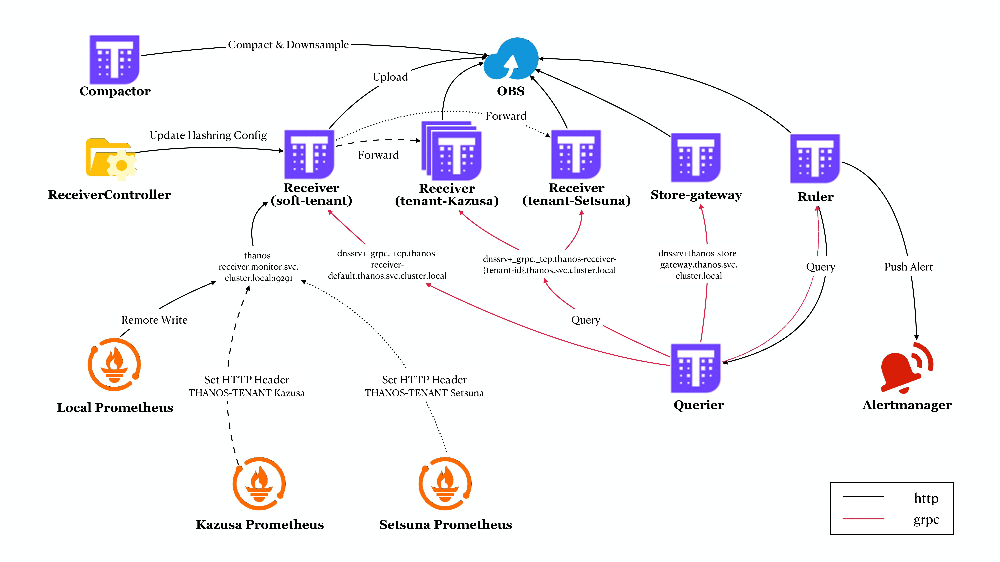

# thanos-k8s-demo

Deploy Thanos on Kubernetes.



## Getting started

- Thanos Version: v0.24.0
- Kubernetes Version: v1.16.9-aliyun.1
- CloudProvider: Alicloud

```shell
git clone https://github.com/koktlzz/thanos-k8s-deployment.git
cd thanos-k8s-deployment
kubectl apply -k overlays/aliclound/
```

## Validation

### Deploy Prometheus in Observee Cluster

```shell
git clone https://github.com/coreos/kube-prometheus.git
cd kube-prometheus
kubectl create -f manifests/setup

# wait for namespaces and CRDs to become available, then
kubectl create -f manifests/
```

### Enable Prometheus Remote Write

Use `kubectl edit -n monitoring prometheus k8s` to enable Prometheus remote write:

```yaml
# local cluster
spec:
  remoteWrite:
    - url: http://thanos-receiver.thanos.svc.cluster.local:19291/api/v1/receive   
# cluster kazusa
spec:
  remoteWrite:
    - url: http://thanos-receiver.uuid.cn-shanghai.alicontainer.com/api/v1/receive
      headers:
        THANOS-TENANT: kazusa
# cluster setsuna
spec:
  remoteWrite:
    - url: http://thanos-receiver.uuid.cn-shanghai.alicontainer.com/api/v1/receive
      headers:
        THANOS-TENANT: setsuna
```

Then you can see three tenants in the Thanos Query UI(`kubectl get ingress -n thanos | grep querier`):


## Reference

[Thanos Remote Write](https://thanos.io/v0.11/201812_thanos-remote-receive.md/)

[Achieve Multi-tenancy in Monitoring with Prometheus & Thanos Receiver](https://www.infracloud.io/blogs/multi-tenancy-monitoring-thanos-receiver/)

[Adopting Thanos at Lastpass](https://krisztianfekete.org/adopting-thanos-at-lastpass/)
